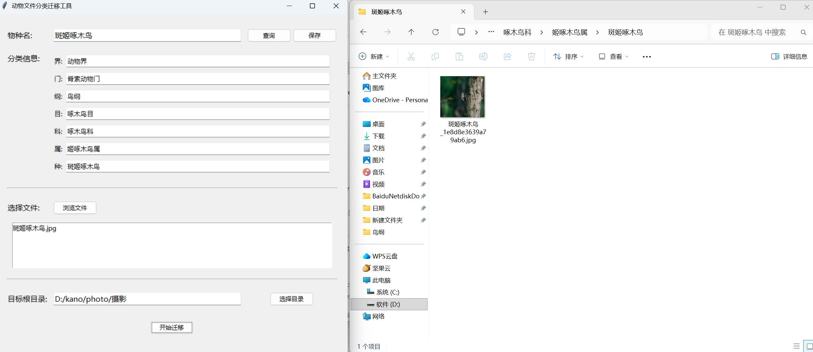

# animal_file_sorter
动物文件本地整理工具。 按界门纲目科属种生成嵌套文件夹，并转移所选文件。支持本地保存查询动物的分类。自动重命名，规则为：种名+hash字符串。

配置文件在用户目录下，名为.animal_classifier_config.json，如果你打鸟比较多，可以直接用代库里的示例配置文件，里面有常见的鸟类。

 简单的vib ecoding项目，个人打鸟记录用。只支持**windows**，下载即可运行。

